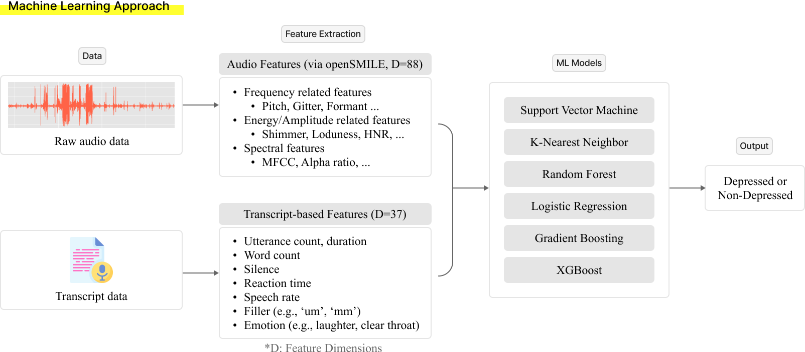
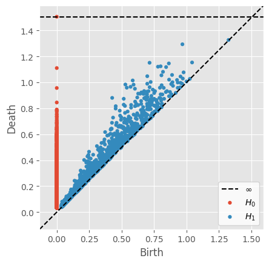

# DS516 Team Project (Group 1)
- Developing an Audio-Based Depression Detection Model
- Gyuna Kim, Soobin Park, Hyeonjin Lim, Seunghyun Kim

<details>
<summary> Setup (click to expand)</summary>

# Setup
## Clone this repository

```bash
git clone https://github.com/gn0219/daic-woz.git
cd daic-woz
```

## Create a virtual environment

Make sure Python is installed. If not, download it from the [official Python website](https://www.python.org/).

```bash
python -m venv .venv
```

Activate the virtual environment:

- **Windows**:

  ```bash
  .venv\Scripts\activate
  ```

- **Mac/Linux**:

  ```bash
  source .venv/bin/activate
  ```

## Install required packages

```bash
pip install -r requirements.txt
```
---

## Download the DAIC-WOZ dataset

### Option 1: Manual download

1. Go to the [DAIC-WOZ official site](https://dcapswoz.ict.usc.edu/)
2. Complete the EULA form and obtain the download link.
2. Download the `.zip` files manually.
3. Move all downloaded `.zip` files into the `downloads/` folder.

### Option 2: Download full dataset with scripts

Make sure to change “BaseUrl” to the actual download URL.

- **Mac/Linux users**:

  ```bash
  bash etc/download.sh
  ```

- **Windows users**:

  Open PowerShell and run:

  ```powershell
  etc\download.ps1
  ```

> These scripts will download and place the files into the `downloads/` folder.

## Unzip and organize files

Run the script below to extract the zip files and organize audio and transcript files:

```bash
python unzip_files.py
```

- Zip files in `downloads/` will be extracted to `unzipped_files/`.
- All `.wav` files will be moved to `wav_files/`.
- All transcript files (`_TRANSCRIPT.csv`) will be moved to `transcript_files/`.

## Project folder structure (after setup)

```plaintext
daic-woz/
│
├── downloads/               # .zip files go here
├── unzipped_files/          # Extracted contents
├── wav_files/               # All .wav audio files
├── transcript_files/        # Transcript CSV files
├── unzip_files.py           # Unzipping and file-moving script
├── src/                     # Source code modules
│   ├── ...
│   └── unzip_files.py 
├── ...
├── requirements.txt         # Python dependencies
└── etc/
    ├── download.sh          # For Mac/Linux
    └── download.ps1         # For Windows
```
</details>

# Analysis
## 0. extract_features.ipynb
This process produces three feature files: `info_df.csv`, `utterance_features.csv`, and `smile_features.csv`.
- Extract utterance-related features from transcription files
- Extract audio features using openSMILE from raw `.wav` files 
- Source code: [`src/extract_features.py`](./src/extract_features.py)

## 1. eda.ipynb
- Visualizes label distribution and audio-derived features
- Visualization functions are modularized in:
  - [`src/visualize_features.py`](./src/visualize_features.py): histograms, boxplots, violin plots
  - [`src/visualize_audio.py`](./src/visualize_audio.py): waveform and log-spectrogram visualizations

## 2. evaluate_basic_models.ipynb


- Implements basic ML model evaluation using only the `train`/`test` splits (excluding `dev`)
- Evaluates 7 models: Baseline (Majority voting), SVM, KNN, Random Forest, Logistic Regression, Gradient Boosting, XGBoost
- Compares three input settings:
  1. SMILE features
  2. Utterance features
  3. Combined features
- Supports optional feature selection using either `kbest` or `model` method
- Source code: [`src/evaluate_ml_models.py`](./src/evaluate_ml_models.py)

## 3. topological_features.ipynb
<div align="center">

</div>

- Initial visualization of topological features from audio-derived point clouds

## 4. SHAP.ipynb
- Conducts **SHAP analysis** on the trained **XGBoost** model
- Provides both global and local interpretability of feature contributions
- Results saved in: [`results/SHAP_result`](./results/SHAP_result/)

# Advanced Methods

## Approach 1: LSTM (`5-1.run_lstm.py`)
- Implements an LSTM model on extracted feature sequences (utterance-related + opensmile)
- Results saved in: [results/lstm_results/*](results/lstm_results/)

## Approach 2: Multimodal learning (`5-2.run_multimodal.py`)
- Applies two **separate DNN encoders** to:
  - Utterance-related features (37 dims)
  - Audio features extracted via openSMILE (88 dims)
- Combines both modalities for classification
- Results saved in: [results/multimodal_results/*](results/multimodal_results/)

## Approach 3: Multitask learning (`5-3.run_multitask_learning.py`)
- Use `gender` as an **auxilary task** to support the main classification task
- Applies **different loss weights** when calculating multitask loss (main task : auxiliary task = 1 : 0.3)
- Compares multitask vs. single-task performance on Accuracy, F1, and AUROC
- Results saved in: [results/multitask/*](results/multitask/)

## Approach 4: Topological Data Analysis (`5-4.tda_depression_detect.py`)
- Applies **persistent homology** to convert audio into topological representations
  - Converts audio into 3D point clouds using sliding windows and PCA  
  - Computes 0D and 1D persistence diagrams with Ripser and transforms them into persistence images  
  - Trains a **Random Forest** classifier on flattened images
  - Evaluated using Accuracy, AUROC, F1, and Confusion Matrix
- Results saved in: [result/tda_result/*](results/tda_result/)

# Project folder structure (after Analysis)

> Note: Files under data/* are not included due to EULA restrictions.
> You can reproduce them by downloading the original data and running 0-1. extract_features.ipynb.

```plaintext
daic-woz/
│   
├── data/                           # CSV files (preprocessed / feature-extracted)
│   ├── df.csv
│   ├── info_df.csv
│   ├── smile_features.csv
│   ├── smile_features_silence_removed.csv
│   ├── utterance_features.csv
│
├── downloads/                      # Raw .zip files (not used during analysis)
├── unzipped_files/                 # Extracted zip contents (not used)
├── wav_files/                      # Raw audio files (.wav) (used during feature extraction)
├── transcript_files/               # Transcription files (_TRANSCRIPT.csv) (used during feature extraction)
│
├── src/                            # Source code modules
│   ├── __init__.py
│   ├── unzip_files.py              # Unzipping script (not used in analysis)
│   ├── extract_features.py         # Feature extraction logic
│   ├── evaluate_ml_models.py       # ML model pipeline
│   ├── visualize_features.py       # Feature-level plots
│   ├── visualize_audio.py          # Audio waveform / spectrogram visualization
│   └── visualize_results.py        # Performance visualization

├── results/                            # Figures and texts
│
├── 0-1. extract_features.ipynb                 # Feature extraction from audio/transcripts
├── 0-2. silence_removal.ipynb                  # Optional: silence removal from audio (preprocessing)
├── 1. eda.ipynb                                # Exploratory Data Analysis (EDA)
├── 2-1. evaluate_basic_models.ipynb            # Classical ML model evaluation
├── 2-2. silence_removed_evaluate_basic_models.ipynb  # ML evaluation after silence removal
├── 3. topological_features.ipynb               # Topological data analysis & visualization
├── 4. SHAP.ipynb                               # SHAP-based model explanation (XGBoost)
│
├── 5-1.run_lstm.py                 # Approach 1: LSTM on sequential features
├── 5-2.run_multimodal.py           # Approach 2: Multimodal deep learning (SMILE + utterance)
├── 5-3.run_multitask_learning.py   # Approach 3: Multitask learning with gender as auxiliary
├── 5-4.tda_depression_detect.py    # Approach 4: Topological Data Analysis (TDA)
│
├── README.md                       
├── requirements.txt               
└── .gitignore                     

```